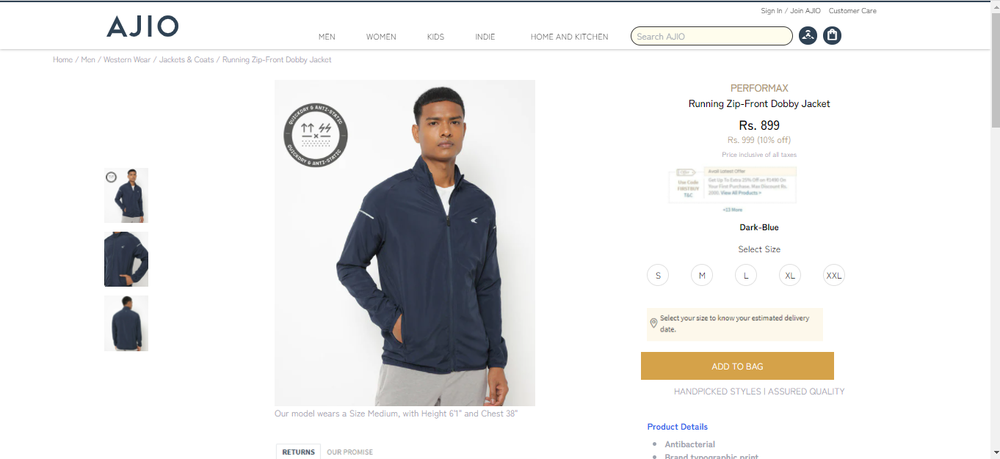

Clone Ajio.com

This is the clone of Ajio.com ,which we made during the UNIT III construct week. This website behaves same as Ajio.com in functionality.

## Screenshots

## Technologies Used

- HTML
- CSS
- Tailwind CSS
- JavScript

## Getting Started :

Prerequisites

- VS Code
  Installation
- Clone the repository
  Git Clone - https://github.com/alhassan069/AJIO

## Website Flow :

## Authors

- [Saurabh Nimkande](https://github.com/saurabhnimkande)
- [Thota Pavan Kumar](https://github.com/ThotaPavanKumar)
- [Shubham Kumar](https://github.com/shubhamkr0412)
- [Prakash Chandra Akash](https://github.com/impcakash)
- [Raman Boddula](https://github.com/raman-boddula)
- [Alimul Hassan](https://github.com/alhassan069)
